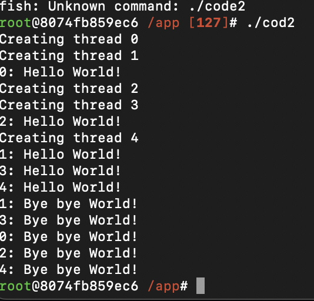

**Nome: [Daniel Braga]**
**Data: [19/05]**
## 1. Objetivo
    Aprofundar os conhecimentos da gestão de tarefas no linux

## 2. Passos Executados
### Primeiro passo
```c
    #include <unistd.h>
    #include <sys/types.h>
    #include <sys/wait.h>
    #include <stdio.h>
    #include <stdlib.h>

    int main(int argc, char *argv[], char *envp[]) {
    int pid; 

    pid = fork(); 

    if (pid < 0) 
    {
        perror("Erro: "); 
        exit(-1);
    }
    else             
        if (pid > 0) 
            wait(0); 
        else         
        {
            
            execve("/bin/date", argv, envp);
            perror("Erro: "); 
        }
    printf("Tchau !\n");
    exit(0);
     } 
```
    
Este programa cria um novo processo através de uma cópia do processo pai (fork) e depois insere o código binário do novo processo (execvel).

### Segundo passo
```c
    #include <pthread.h>
    #include <stdio.h>
    #include <stdlib.h>
    #include <unistd.h>

    #define NUM_THREADS 5

    void *print_hello(void *threadid)
    {
        printf("%ld: Hello World!\n", (long)threadid);
        sleep(5);
        printf("%ld: Bye bye World!\n", (long)threadid);
        pthread_exit(NULL); 
    }

    int main(int argc, char *argv[])
    {
        pthread_t thread[NUM_THREADS];
        long status, i;

        for (i = 0; i < NUM_THREADS; i++)
        {
            printf("Creating thread %ld\n", i);
            status = pthread_create(&thread[i], NULL, print_hello, (void *)i);

            if (status) 
            {
                perror("pthread_create");
                exit(-1);
            }
        }

        pthread_exit(NULL);
    }
```

O programa acima cria uma thread, e a partir dela, outras são criadas e indicadas a excutar o mesmo código ao mesmo tempo.

## 1. Resultados Obtidos

### Saida 1:


### Saida 2:


## 2. Conclusão

Este conhecimento é importante para entender melhor como que funciona o gerênciamento de processos dentro de um kernel e assim gerênciar melhor os recursos de hardware.